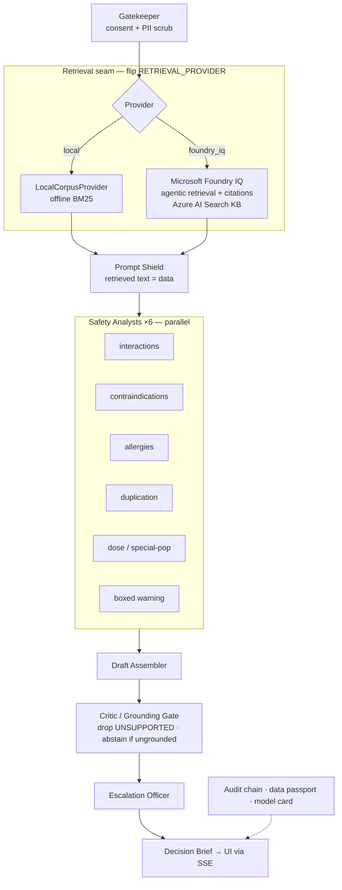

# Pharos

<p align="center">
  <strong>Point-of-care medication decision support — cited, triaged, grounded, and honest when it doesn't know.</strong>
</p>

<p align="center">
  <a href="https://github.com/parikshit06reddy-cloud/pharos/actions/workflows/ci.yml"></a>
  <a href="LICENSE"></a>
  
  
  
  
</p>

<p align="center">
  <a href="#quickstart-60-seconds">Quickstart</a> ·
  <a href="#architecture">Architecture</a> ·
  <a href="#evaluation">Evaluation</a> ·
  <a href="#microsoft-foundry-iq">Foundry IQ</a> ·
  <a href="#demo-video">Demo video</a> ·
  <a href="DEMO_SCRIPT.md">Demo script</a>
</p>

---

> **Submission · Microsoft Agents League @ AI Skills Fest 2026**  
> **Track:** Reasoning Agents · **Platform:** Microsoft Foundry + Foundry IQ  
> **Repo:** https://github.com/parikshit06reddy-cloud/pharos  
>
> ⚠️ **Synthetic patient data only · Not medical advice · Not for clinical use**  
> Pharos **informs** clinicians with cited evidence and options — it **never prescribes or orders**.

---

## At a glance

| | |
|---|---|
| **Problem** | At the bedside, prescribers need *patient-specific* medication safety reasoning — not generic drug facts, not confident hallucinations. |
| **Solution** | An eight-stage **multi-agent reasoning pipeline**: retrieve evidence → six parallel safety specialists → synthesizer → **critic / grounding gate** → triage → cited **Decision Brief**. |
| **Thesis** | *An agent that abstains when unsure is safer than one that always answers.* |
| **Foundry IQ** | Agentic retrieval over an Azure AI Search knowledge base via a single adapter seam — flip one env var; safety pipeline unchanged. |
| **Offline demo** | Full `make test && make eval && make run` with **zero Azure credentials** — judges reproduce everything locally. |
| **Persona** | **Dr. Maya Chen**, hospitalist — ninety seconds mid-round, needs cited risks for *this* patient, not prose. |

---

## Why Pharos wins the brief

Pharos is built for the **Reasoning Agents** rubric — not a chat wrapper, but a decomposed agent system with a visible trace:

| Rubric dimension | How Pharos delivers |
|---|---|
| **Accuracy & relevance (20%)** | Patient-specific reasoning over FDA label text; every clinical claim carries a citation key; 100% must-flag coverage on curated + held-out suites. |
| **Reasoning & multi-step (20%)** | Named agent roles (Gatekeeper → Researcher → Safety Analysts ×6 → Critic → Escalation Officer); live SSE trace expandable in the UI. |
| **Reliability & safety (20%)** | Grounding gate drops fabricated claims (100% drop-recall); abstention; Prompt-Shields-style injection guard; consent gate; hash-chained audit log. |
| **Creativity (15%)** | "Know when to abstain" as the core innovation; contradiction guard catches false-reassurance attacks lexical overlap would pass. |
| **UX & presentation (15%)** | Clinical-instrument UI; severity-first design; one-click source drawer; enterprise case workflow + human-in-the-loop agent. |

**Prize fit:** Best Reasoning Agent · Best use of Foundry IQ tools · Hack for Good · Accessibility.

---

## See it work

**Serious interaction** — severity-triaged, grounded, cited (click any citation chip to open the source passage):


**Abstention + injection defense** — hidden label instruction stripped; overdose still escalates to **Urgent**:


**Enterprise workflow** — intake, routing, worklists, and a tool-calling assistant that **proposes** actions for human confirmation:

<p>
  
  
</p>

---

## Architecture

Multi-agent pipeline with **Microsoft Foundry IQ** as the swappable retrieval seam and a **critic / grounding gate** as the safety core:



<details>
<summary><strong>Reasoning agent roster</strong> (streamed to UI + <code>GET /health</code>)</summary>

| Agent | Pattern | Responsibility |
|---|---|---|
| **Gatekeeper** | guardrail | Consent gate + PII scrub |
| **Researcher** | tool-use | Foundry IQ retrieval (or offline BM25) |
| **Prompt Shield** | guardrail | Strip instruction-like text from retrieved content |
| **Safety Analyst ×6** | parallel-executor | Interactions, contraindications, allergies, duplication, dose/special-pop, boxed warning |
| **Draft Assembler** | executor | Assemble answer + options from findings |
| **Critic / Grounding Gate** | critic-verifier | Grade each claim vs cited passage; drop UNSUPPORTED; abstain |
| **Escalation Officer** | executor | Severity tier + emergency resources |

Each stage emits an SSE event with its **role label**; the UI trace is **expandable** — judges can inspect specialist findings, sources, and verifier grades.

</details>

Deep dive: [ARCHITECTURE.md](ARCHITECTURE.md) · Foundry runbook: [FOUNDRY_SETUP.md](FOUNDRY_SETUP.md)

---

## Microsoft Foundry IQ

Pharos is **architected for Foundry IQ**. The `RetrievalProvider` adapter in `backend/retrieval/foundry_iq.py` is the **only** module that talks to Foundry — stages 3–8 are identical regardless of provider.

| Mode | Command | Who it's for |
|---|---|---|
| **Offline demo** (default) | `make eval` | Judges — zero Azure credentials |
| **Foundry replay** | `RETRIEVAL_PROVIDER=foundry_replay make eval` | Proves adapter on captured GA-shaped response |
| **Live Foundry IQ** | `RETRIEVAL_PROVIDER=foundry_iq` + [FOUNDRY_SETUP.md](FOUNDRY_SETUP.md) | Full tenant demo + IQ-tools prize |

| Component | Offline default | Live Foundry path |
|---|---|---|
| Retrieval | `LocalCorpusProvider` (BM25) | `FoundryIQProvider` — agentic retrieval + citations |
| Grounding gate | Always in-pipeline | **Unchanged** — Pharos controls what reaches the clinician |
| Expert router | `LocalRouter` | `FoundryRouter` (`ROUTER_PROVIDER=foundry`) |
| Navigation agent | `LocalAgent` | `FoundryAgent` (`AGENT_PROVIDER=foundry`) |

> **Verified live (2026-06-12):** Foundry IQ path scored **100%** on the full suite with safety pipeline unchanged — [eval/scorecard_foundry_iq.md](eval/scorecard_foundry_iq.md). Ingestion: `python -m scripts.foundry_ingest`.

Pharos uses Foundry IQ's **direct retrieve** (extractive, GA `2026-04-01`) — not answer synthesis — so the grounding gate stays in control.

---

## Quickstart (60 seconds)

**Prerequisites:** Python 3.11+, Node 18+ (frontend only)

```bash
git clone https://github.com/parikshit06reddy-cloud/pharos.git && cd pharos
python3 -m venv .venv && source .venv/bin/activate
pip install -r requirements.txt
make test && make eval          # 99 tests · 100% hard safety metrics
make run                        # API → http://localhost:8000
```

**Frontend** (second terminal):

```bash
cd frontend && npm ci && npm run dev   # UI → http://localhost:5173
```

Sign in: `frontdesk` / `pharos123` → **Quick brief** → click **Warfarin + fluconazole** → **Generate decision brief**.

<details>
<summary><strong>API-only smoke test</strong></summary>

```bash
curl -s localhost:8000/health | python3 -m json.tool
curl -s localhost:8000/brief/sync -H 'content-type: application/json' \
  -d @data/synthetic_cases/case01_warfarin_fluconazole.json | python3 -m json.tool
```

</details>

<details>
<summary><strong>Demo accounts</strong> (password <code>pharos123</code>)</summary>

| Role | Username | Specialty |
|---|---|---|
| Front desk | `frontdesk` | — |
| Admin | `admin` | — |
| Doctor | `hart` | Hematology |
| Doctor | `cardoso` | Cardiology |
| Doctor | `renner` | Nephrology |
| Doctor | `lin` | Infectious Disease |
| Doctor | `mensah` | Psychiatry |
| Doctor | `dahl` | Dermatology |
| Doctor | `tan` | Toxicology |
| Doctor | `gold` | General Medicine |

</details>

---

## Evaluation

`make eval` reports **three independent views** — not a circular self-authored benchmark ([full scorecard](eval/scorecard.md)):

| Suite | Cases | Hard metrics |
|---|---:|---|
| **Curated** | 12 | 100% accuracy · abstention · escalation · must-flag · injection · grounding · routing |
| **Held-out adversarial** | 4 | 100% — negative control, injection-in-question, lay-belief abstain, polypharmacy distractor |
| **Grounding-gate benchmark** | 21 claims | 100% fabrication drop-recall · 100% drop-precision (incl. false-reassurance attacks) |

Median pipeline latency: **< 1 ms** offline. Adversarial cases include `case10`/`case11` (must abstain) and `case12` (injection + urgent overdose).

**Honest robustness probe:** `make eval-live` re-runs cases against **real openFDA label text** — soft metrics drop on raw phrasing (reported honestly); safety invariants hold. That's the gap Foundry IQ's semantic ranker closes.

---

## Safety & responsible AI

Five non-negotiable principles — mapped to Foundry Guardrails & Controls categories in [SAFETY.md](SAFETY.md):

1. **Clinician-in-command** — options, never orders  
2. **Grounding gate + abstention** — no fabricated citations; drop UNSUPPORTED; abstain when evidence is thin  
3. **Public + synthetic data only** — openFDA/RxNorm; enforced consent gate  
4. **Prompt-injection defense** — retrieved text is data, not instructions  
5. **Privacy by design** — PII scrubbed at intake; hash-only audit; one-tap session delete  

Corpus files are marked *representative excerpt, not for clinical use*. Pharos is a **research prototype**.

---

## Enterprise workflow

Hospital case-management built around the same Decision Brief:

```
Intake → triage (Decision Brief) → route to specialist → human-confirmed assign → doctor worklist → review / complete / escalate
```

- Role-based auth, filterable worklists, ops dashboard  
- Expert routing with grounded rationale — **suggests**, never auto-assigns  
- Docked tool-calling assistant — state-changing actions require **your confirmation**  

---

## Tech stack

| Layer | Technologies |
|---|---|
| Reasoning | Python 3.11+, FastAPI, Pydantic v2, parallel specialists + critic gate |
| Grounding | **Microsoft Foundry IQ** (Azure AI Search KB) · offline BM25 fallback |
| Safety | `verifier.py` · `injection_guard.py` · `intake.py` consent gate · hash-chained audit |
| Workflow | SQLModel + SQLite · JWT demo auth · tool-calling agent |
| Frontend | React 18 · TypeScript · Vite · Tailwind CSS |
| Quality | GitHub Actions CI · pytest (99) · ruff · mypy · `make eval` hard gates |

---

## Project structure

```
backend/               pipeline, specialists, verifier, intake, injection guard
backend/retrieval/     Foundry IQ adapter + offline corpus  ← Foundry seam
backend/routing/       expert router (local + Foundry)
backend/agent/         navigation agent (local + Foundry)
backend/governance/    audit log · data passport · model card
frontend/              React app — reasoning trace · worklists · agent panel
corpus/labels/         curated public FDA excerpts (offline KB)
data/synthetic_cases/  12 eval cases · data/holdout_cases/ 4 adversarial
eval/                  scorecard · gate_benchmark.json
tests/                 99 tests incl. Foundry adapter replay + safety e2e
```

Full docs: [ARCHITECTURE.md](ARCHITECTURE.md) · [SAFETY.md](SAFETY.md) · [FOUNDRY_SETUP.md](FOUNDRY_SETUP.md) · [DEMO_SCRIPT.md](DEMO_SCRIPT.md) · [SUBMISSION_CHECKLIST.md](SUBMISSION_CHECKLIST.md) · [RESEARCH.md](RESEARCH.md)

---

## Demo video

▶ **[Demo video — link TBD]** — ≤5 min walkthrough ([shot list in DEMO_SCRIPT.md](DEMO_SCRIPT.md))

Record: reasoning trace expansion · citation drawer · abstention · injection defense · why Foundry IQ matters.

---

## License

[MIT](LICENSE) — research/demo prototype. **Not medical advice. Synthetic data only.**
