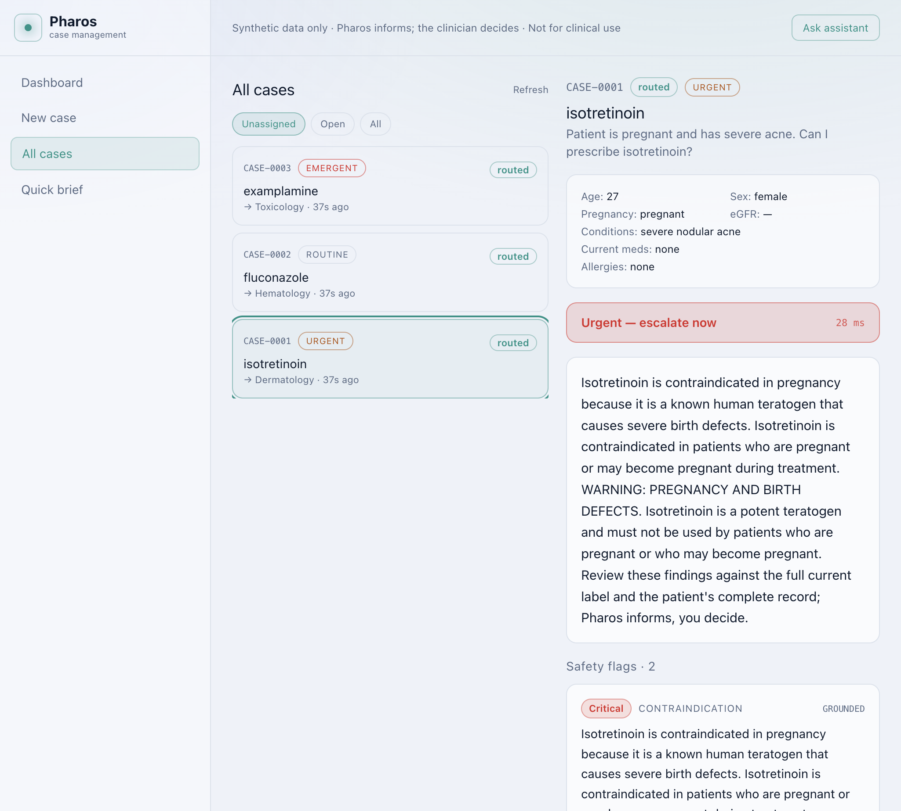
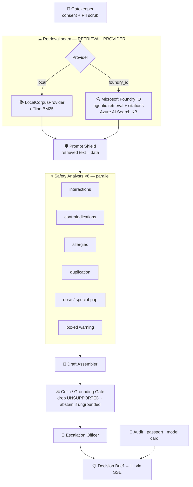

<p align="center">
  
</p>

<h1 align="center">Pharos</h1>

<p align="center">
  <strong>The reasoning agent that knows when <em>not</em> to answer.</strong><br/>
  Patient-specific medication safety — every claim cited, severity-triaged, and grounded in FDA label evidence.<br/>
  Built for <strong>Microsoft Agents League @ AI Skills Fest 2026</strong> · Reasoning Agents track.
</p>

<p align="center">
  <a href="https://github.com/parikshit06reddy-cloud/pharos/actions/workflows/ci.yml"></a>
  <a href="LICENSE"></a>
  
  
  
  
</p>

<p align="center">
  <a href="https://github.com/parikshit06reddy-cloud/pharos/stargazers"></a>
</p>

<p align="center">
  
  
  
  
  
  
</p>

<p align="center">
  <a href="#-quickstart"><b>⚡ Quickstart</b></a> ·
  <a href="#-see-it-work"><b>📸 Demo</b></a> ·
  <a href="#-architecture"><b>🏗 Architecture</b></a> ·
  <a href="#-evaluation"><b>📊 Evaluation</b></a> ·
  <a href="#-microsoft-foundry-iq"><b>☁ Foundry IQ</b></a> ·
  <a href="DEMO_SCRIPT.md"><b>🎬 Demo script</b></a> ·
  <a href="#-demo-video"><b>▶ Video</b></a>
</p>

---

<table align="center">
<tr>
<td align="center" width="25%">
<h3>🎯</h3>
<b>100%</b><br/><sub>hard eval metrics</sub>
</td>
<td align="center" width="25%">
<h3>🧠</h3>
<b>7 agents</b><br/><sub>named reasoning roles</sub>
</td>
<td align="center" width="25%">
<h3>🛡</h3>
<b>100%</b><br/><sub>fabrication drop-recall</sub>
</td>
<td align="center" width="25%">
<h3>⚡</h3>
<b>&lt;1 ms</b><br/><sub>offline pipeline</sub>
</td>
</tr>
</table>

> ### 🏥 Submission · Microsoft Agents League @ AI Skills Fest 2026
> **Track:** Reasoning Agents · **Platform:** [Microsoft Foundry](https://azure.microsoft.com/products/ai-foundry) + **Foundry IQ**  
> **Repository:** https://github.com/parikshit06reddy-cloud/pharos
>
> ⚠️ **Synthetic patient data only · Not medical advice · Not for clinical use**  
> Pharos **informs** with cited evidence and options — it **never prescribes or orders**.

---

## 💡 The problem

At the point of prescribing, the question is never *"what is this drug?"* — it's:

> **"Given *this* patient, what could go wrong — and how sure are we?"**

| Approach | Failure mode |
|---|---|
| Interaction checkers | Patient context in isolation |
| General chat models | Confident answers with **fabricated citations** |
| Always-on agents | No honest **"I don't know"** when evidence is thin |

**Pharos thesis:** *An agent that abstains when unsure is more useful at the bedside than one that always answers.*

**Persona:** **Dr. Maya Chen**, hospitalist — ninety seconds mid-round, needs cited risks for *this* patient, not prose.

---

## ✨ What Pharos does

<p align="center">
  
  <br/>
  <sub><b>Decision Brief</b> — serious interaction flagged, review recommended, every claim opens its FDA label source</sub>
</p>

<table>
<tr>
<td width="50%" valign="top">

### 🔬 Multi-agent reasoning
Eight-stage pipeline with **named roles** streamed live to the UI:
Gatekeeper → Researcher → Prompt Shield → **6× Safety Analysts** → Draft Assembler → **Critic** → Escalation Officer.

</td>
<td width="50%" valign="top">

### 📎 Grounded by design
Every clinical sentence is graded against its **cited passage**. UNSUPPORTED claims are **dropped**. Too little evidence → **abstention**, not guessing.

</td>
</tr>
<tr>
<td width="50%" valign="top">

### 🛡 Safety-first
Prompt-injection defense · consent gate · PII scrub · hash-chained audit log · one-tap session delete. Mapped to Foundry Guardrails & Controls in [SAFETY.md](SAFETY.md).

</td>
<td width="50%" valign="top">

### ☁ Microsoft Foundry IQ
Agentic retrieval over Azure AI Search KB via a **single adapter seam** — flip `RETRIEVAL_PROVIDER=foundry_iq`; safety pipeline **unchanged**. Offline demo needs **zero Azure credentials**.

</td>
</tr>
</table>

---

## 📸 See it work

<table>
<tr>
<td width="50%">

<br/><sub><b>Injection + escalation</b> — hidden label instruction stripped; overdose still → Urgent + Poison Control</sub>
</td>
<td width="50%">

<br/><sub><b>Enterprise workflow</b> — intake, routing, worklists, ops dashboard</sub>
</td>
</tr>
<tr>
<td width="50%">

<br/><sub><b>Tool-calling assistant</b> — proposes assignments; human confirms</sub>
</td>
<td width="50%">

<br/><sub><b>Case intake</b> — synthetic patient context → grounded Decision Brief</sub>
</td>
</tr>
</table>

---

## 🏗 Architecture

<p align="center">
  
  
  
  
</p>



<details open>
<summary><b>Reasoning agent roster</b> — streamed to UI + <code>GET /health</code></summary>

| # | Agent | Pattern | Stage |
|:-:|---|---|---|
| 1 | **Gatekeeper** | guardrail | Consent + PII scrub |
| 2 | **Researcher** | tool-use | Foundry IQ / BM25 retrieval |
| 3 | **Prompt Shield** | guardrail | Injection strip + flag |
| 4 | **Safety Analyst ×6** | parallel-executor | Interactions · CI · allergies · duplication · dose · boxed |
| 5 | **Draft Assembler** | executor | Answer + options |
| 6 | **Critic / Grounding Gate** | critic-verifier | Grade · drop · abstain |
| 7 | **Escalation Officer** | executor | Triage + emergency resources |

Expand any row in the **live reasoning trace** to inspect specialist findings, sources, and verifier grades.

</details>

📖 [ARCHITECTURE.md](ARCHITECTURE.md) · 🔧 [FOUNDRY_SETUP.md](FOUNDRY_SETUP.md)

---

## ☁ Microsoft Foundry IQ

Pharos is **architected for Foundry IQ**. `backend/retrieval/foundry_iq.py` is the **only** Foundry touchpoint — stages 3–8 never change.

| Mode | How to run | Best for |
|:---:|---|---|
| 🖥 | `make eval` *(default)* | Judges — **zero Azure credentials** |
| 🔄 | `RETRIEVAL_PROVIDER=foundry_replay make eval` | Proves adapter on captured GA response |
| ☁ | `RETRIEVAL_PROVIDER=foundry_iq` + [setup guide](FOUNDRY_SETUP.md) | Live demo · **IQ-tools prize** |

| Component | Offline | Live Foundry |
|---|---|---|
| Retrieval | BM25 corpus | **FoundryIQProvider** — agentic retrieval + citations |
| Grounding gate | In-pipeline | **Unchanged** — Pharos controls clinician output |
| Router / Agent | Deterministic | Foundry LLM adapters (`ROUTER_PROVIDER` / `AGENT_PROVIDER`) |

> ✅ **Verified live (2026-06-12):** Foundry IQ scored **100%** on the full suite — [scorecard](eval/scorecard_foundry_iq.md) · Ingest: `python -m scripts.foundry_ingest`

---

## ⚡ Quickstart

```bash
git clone https://github.com/parikshit06reddy-cloud/pharos.git && cd pharos
python3 -m venv .venv && source .venv/bin/activate
pip install -r requirements.txt

make test          # 99 tests
make eval          # 100% hard safety metrics
make run           # → http://localhost:8000
```

```bash
# Second terminal — UI
cd frontend && npm ci && npm run dev    # → http://localhost:5173
```

**Try it:** sign in `frontdesk` / `pharos123` → **Quick brief** → **Warfarin + fluconazole** → **Generate decision brief** → expand the reasoning trace.

<details>
<summary><b>One-liner API demo</b></summary>

```bash
curl -s localhost:8000/brief/sync -H 'content-type: application/json' \
  -d @data/synthetic_cases/case01_warfarin_fluconazole.json | python3 -m json.tool
```

</details>

<details>
<summary><b>Demo accounts</b> (password <code>pharos123</code>)</summary>

| Role | User | Specialty |
|---|---|---|
| Front desk | `frontdesk` | — |
| Doctor | `hart` | Hematology |
| Doctor | `cardoso` | Cardiology |
| Doctor | `renner` | Nephrology |
| Doctor | `lin` | Infectious Disease |
| Doctor | `mensah` | Psychiatry |
| Doctor | `tan` | Toxicology |
| Admin | `admin` | — |

</details>

---

## 📊 Evaluation

Three **independent** views — not a circular benchmark. Full report: [eval/scorecard.md](eval/scorecard.md)

| Suite | n | Result |
|---|--:|---|
| **Curated** | 12 | 100% accuracy · abstention · escalation · must-flag · injection · grounding · routing |
| **Held-out adversarial** | 4 | 100% — negative control · injection-in-question · lay-belief abstain · polypharmacy distractor |
| **Grounding-gate benchmark** | 21 | 100% fabrication drop-recall · 100% drop-precision incl. false-reassurance attacks |

```bash
make eval          # hard-gated scorecard (CI runs this)
make eval-live     # honest probe on real openFDA text (informational)
```

---

## 🏆 Rubric alignment · AI Skills Fest 2026

| Criterion | Weight | Evidence in Pharos |
|---|--:|---|
| Accuracy & relevance | 20% | Cited claims · patient-specific specialists · 100% must-flag on eval |
| Reasoning & multi-step | 20% | 7 named agents · parallel specialists · critic gate · live SSE trace |
| Reliability & safety | 20% | Abstention · injection guard · audit chain · adversarial test suite |
| Creativity | 15% | "Abstain when unsure" thesis · contradiction guard · condition-gated specialists |
| UX & presentation | 15% | Severity-first UI · citation drawer · expandable trace · enterprise workflow |
| Community vote | 10% | Clear story · working demo · honest safety framing |

**Prize categories:** Best Reasoning Agent · Best use of Foundry IQ tools · Hack for Good · Accessibility

---

## 🛡 Safety

| Principle | Mechanism |
|---|---|
| Clinician-in-command | Options, never orders |
| Grounding gate | Drop UNSUPPORTED · abstain below threshold |
| Synthetic data only | Consent gate · openFDA/RxNorm |
| Injection defense | Retrieved text = data, not instructions |
| Privacy | PII scrub · hash-only audit · session delete |

→ Full details: [SAFETY.md](SAFETY.md)

---

## 📁 Project structure

```
pharos/
├── backend/
│   ├── pipeline.py          # orchestrator · SSE stream
│   ├── verifier.py          # critic / grounding gate  ← safety core
│   ├── retrieval/           # Foundry IQ adapter       ← Foundry seam
│   ├── specialists/         # 6 parallel safety analysts
│   ├── agent/ · routing/    # HITL assistant + expert router
│   └── governance/          # audit · passport · model card
├── frontend/                # React · reasoning trace · worklists
├── eval/                    # scorecard · gate benchmark
├── tests/                   # 99 tests incl. Foundry replay
└── docs/screenshots/        # UI captures for judges
```

**Documentation:** [ARCHITECTURE](ARCHITECTURE.md) · [SAFETY](SAFETY.md) · [FOUNDRY_SETUP](FOUNDRY_SETUP.md) · [DEMO_SCRIPT](DEMO_SCRIPT.md) · [SUBMISSION_CHECKLIST](SUBMISSION_CHECKLIST.md) · [RESEARCH](RESEARCH.md)

---

## ▶ Demo video

**[Demo video — link TBD]** · ≤5 min · [shot-by-shot script →](DEMO_SCRIPT.md)

*Show: reasoning trace expansion · citations · abstention · injection defense · Foundry IQ*

---

## 📄 License

[MIT](LICENSE) — research prototype. **Not medical advice. Synthetic data only.**

<p align="center">
  <sub>If Pharos helps your work, consider ⭐ starring the repo — it helps judges discover it.</sub>
</p>
